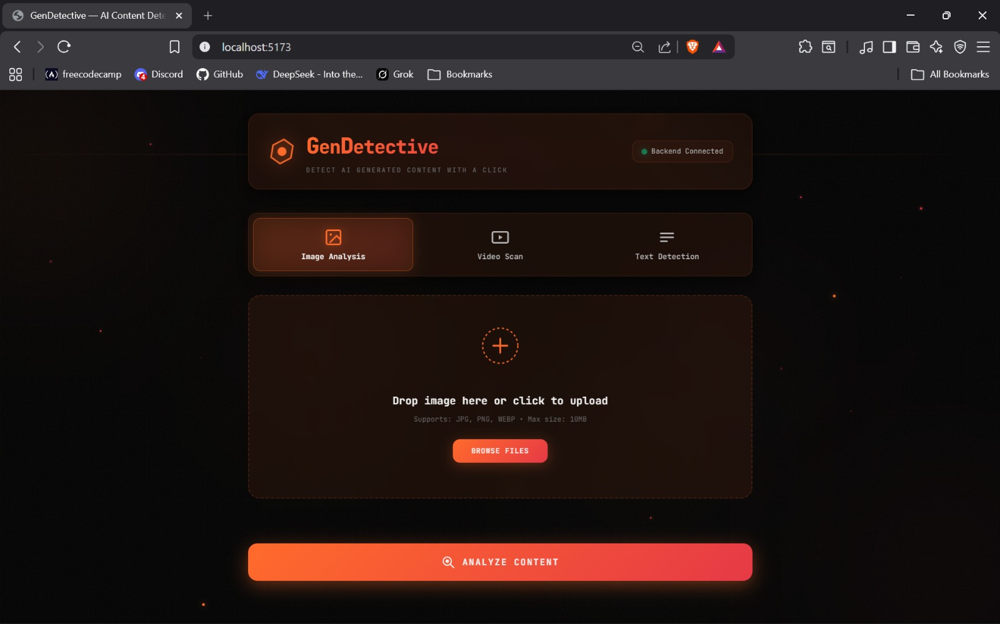
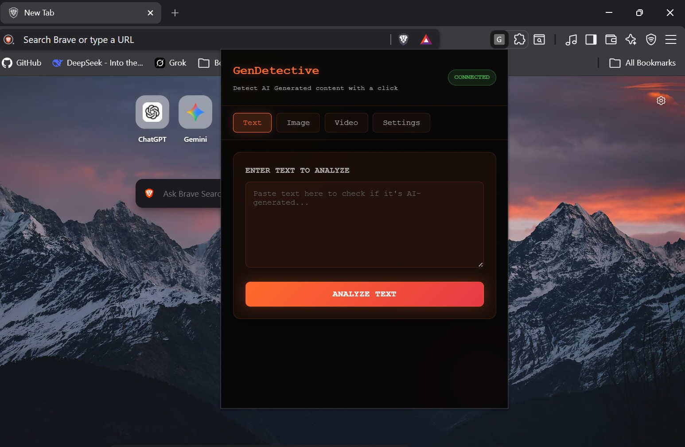
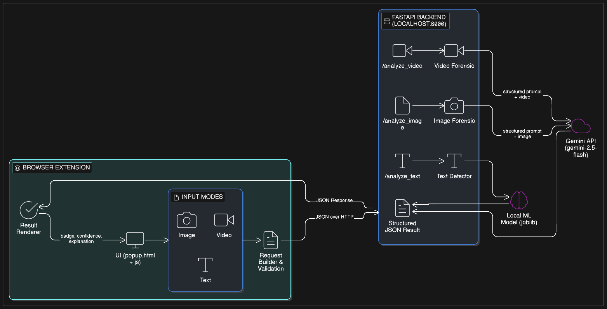

# GenDetective


GenDetective is a multimodal AI-content detection system designed as a Chrome browser extension / Web-App backed by an integrated FastAPI backend. It detects whether images, videos, audio or text are AI-generated using a hybrid forensic approach that combines:

- Statistical and signal-based analysis
- ML-based classification
- CLIP semantic modeling
- LLM (Gemini) assisted multimodal reasoning

This integration improves detection robustness, confidence calibration, and interpretability compared to single-method detectors and models.

---
<h3 align="center">Web Dashboard</h3>
<p align="center">
  
</p>

<h3 align="center">Chrome Extension</h3>
<p align="center">
  
</p>

## Table of Contents

1. [Features](#features)
2. [System Architecture](#system-architecture)
3. [Project Structure](#project-structure)
4. [Tech Stack](#tech-stack)
5. [Getting Started](#getting-started)
6. [Testing and Evaluation](#testing-and-evaluation)
7. [Use Cases](#use-cases)

---

## Features

### Image Detection

- EXIF metadata inspection
- Frequency spectrum and noise analysis
- CLIP semantic similarity scoring
- Gemini-assisted forensic reasoning using structured prompts

### Video Detection

- Temporal consistency analysis
- Face symmetry, jitter, and texture analysis
- Frame-level forensic feature extraction
- Gemini multimodal reasoning on video segments

### Text Detection

- Locally trained ML classifier
- Logistic regression for fast and interpretable inference
- TF-IDF character n-gram modeling
- No external API required for text detection

### Audio Detection (not yet implemented)

- Temporal consistency analysis
- Voice naturalness indicators
- Wav2Vec2 / HuBERT models for semantic and acoustic detection
- LLM-based audio reasoning

---

## System Architecture

<p align="center">
  
</p>

---

## Project Structure

```
gendetective/
|-- backend/
|   |-- __init__.py
|   |-- backend.py
|-- src/
|   |-- components/
|   |-- extension/
|   |-- App.css
|   |-- App.jsx
|   |-- main.jsx
|-- .gitignore
|-- README.md
|-- bun.lock
|-- index.html
|-- package-lock.json
|-- package.json
|-- vite.config.js
```

---

## Tech Stack

### Frontend (Extension + Dashboard)

- React (Vite)
- Chrome Extension APIs

### Backend

- FastAPI -- REST API framework
- Python
- NumPy, SciPy -- statistical analysis
- OpenCV -- image and video forensics
- Transformers (CLIP) -- vision-language embeddings
- Joblib -- ML model serialization and loading
- Huggingface Spaces -- Backend build and deployment
- Pre-trained models for audio analysis (Wav2Vec2 / HuBERT) -- planned

### AI / ML

- Scikit-learn -- model training and inference
- Google Gemini API -- multimodal reasoning
- CLIP -- vision-language model

---

## Getting Started

### Prerequisites

- Python 3.9 or higher
- Node.js 18 or higher (npm included)

### 1. Clone the Repository

```bash
git clone https://github.com/<your-username>/gendetective.git
cd gendetective
```

### 2. Backend Setup

#### 2.1 Create and activate a virtual environment

```bash
cd backend
python -m venv venv
```

On Windows:

```bash
venv\Scripts\activate
```

On macOS / Linux:

```bash
source venv/bin/activate
```

#### 2.2 Install Python dependencies

```bash
pip install -r requirements.txt
```

#### 2.3 Configure environment variables

Create a `.env` file in the project root (not inside `backend/`):

Open `.env` and add your Gemini API key:

```
GEMINI_API_KEY=your_actual_gemini_api_key
```


#### 2.4 Run the backend server

```bash
cd backend
uvicorn backend:app --host 0.0.0.0 --port 7860 --reload
```

The API will be available at `http://localhost:7860`. 

### 3. Frontend Setup

Open a new terminal window and navigate to the project root:

#### 3.1 Install frontend dependencies

```bash
npm install
```

#### 3.2 Run the development server

```bash
npm run dev
```

The dashboard will be available at `http://localhost:5173` 

### 4. Chrome Extension Setup

1. Open Google Chrome and navigate to `chrome://extensions/`
2. Enable "Developer mode" using the toggle in the top-right corner
3. Click "Load unpacked"
4. Select the `src/extension/` directory from the project
5. The GenDetective extension icon will appear in your browser toolbar
6. Pin the extension for quick access


---

## Testing and Evaluation

GenDetective has been evaluated on real-world benchmark datasets for each supported modality. For each modality, 20 samples were randomly selected -- 10 AI-generated and 10 real/human-authored -- and run through the full detection pipeline to measure end-to-end accuracy.

### Datasets

| Modality | Dataset | Link |
|---|---|---|
| Image | AI Generated Images vs Real Images | [Kaggle](https://www.kaggle.com/datasets/cashbowman/ai-generated-images-vs-real-images) |
| Video | RealAI Video Dataset | [Kaggle](https://www.kaggle.com/datasets/kanzeus/realai-video-dataset) |
| Text | AI vs Human Text | [Kaggle](https://www.kaggle.com/datasets/shanegerami/ai-vs-human-text) |

### Evaluation Results

| Modality | Dataset | Samples Tested |
|---|---|:---:|
| Image | AI Generated Images vs Real Images | 20 |
| Video | RealAI Video Dataset | 20 |
| Text | AI vs Human Text | 20 |

Across all three implemented modalities, GenDetective achieved an overall accuracy of approximately **85%** on the sampled test sets.

### Methodology

- **Balanced sampling** -- 10 AI-generated and 10 real/human samples per modality
- **Full pipeline evaluation** -- each sample passed through preprocessing, forensic feature extraction, model inference, and Gemini-assisted reasoning where applicable
- **Ground-truth matching** -- a prediction is correct if the confidence label matches the dataset annotation
- **Accuracy** -- proportion of correctly classified samples out of 20 per modality

### Observations and Limitations

- The approximately 85% overall accuracy validates the hybrid forensic approach, combining statistical, semantic, and LLM-based signals across modalities.
- Performance on image and video detection benefits significantly from Gemini multimodal reasoning, particularly for samples with subtle generative artefacts not captured by traditional frequency analysis.
- Text detection achieved comparable accuracy using only the local ML model (logistic regression + TF-IDF), confirming that lightweight classifiers can be competitive without requiring external API calls.
- Sample size of 20 per modality is intentionally small for initial validation. Broader benchmarking across larger, more diverse test sets is planned.
- Audio detection is not yet implemented and is excluded from the current evaluation.
- Gemini API availability may affect reproducibility of image and video results in offline environments.

---

## Use Cases

- Fake news and misinformation detection
- Deepfake awareness tools
- Academic research
- AI safety and trust systems
- Browser-level content verification
